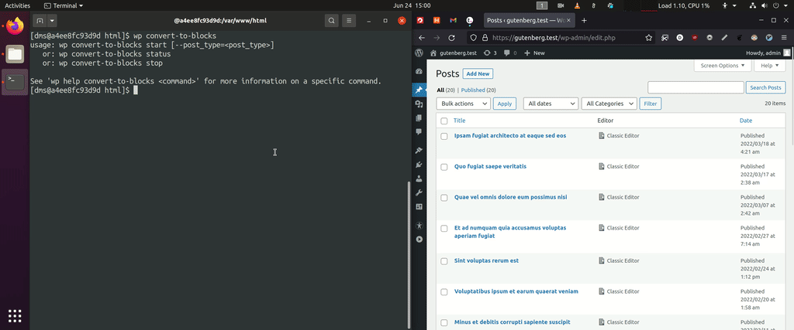

# Convert to Blocks

> Transforms classic editor content to blocks on-the-fly.

   

  

## Overview

Convert to Blocks is a WordPress plugin that transforms classic editor content to blocks on-the-fly. After installing Gutenberg or upgrading to WordPress 5.0+, your content will be displayed in "Classic Editor Blocks". While these blocks are completely functional and will display fine on the frontend of your website, they do not empower editors to fully make use of the block editing experience. In order to do so, your classic editor posts need to be converted to blocks. This plugin does that for you "on the fly". When an editor goes to edit a classic post, the content will be parsed into blocks. When the editor saves the post, the new structure will be saved into the database. This strategy reduces risk as you are only altering database values for content that needs to be changed.

### Bulk migration of Classic Editor items to the Block Editor

The `wp convert-to-blocks start` [WP-CLI command](https://github.com/10up/convert-to-blocks/blob/4df0e970c51eee8d84e3edf3c6210dc10011d574/includes/ConvertToBlocks/MigrationCommand.php) that converts posts iteratively in the browser without requiring any manual input.  One caveat worth mentioning is that Gutenberg is a CPU intensive application.  You will want to keep your computer plugged in before doing this!

## Requirements

- PHP 8+
- WordPress 6.1+
- Inner Blocks Transforms is only supported with the Gutenberg Plugin 10.9.0+

## Installation

1. Clone the repository into your `/plugins` directory.
2. Inside the repository directory, run `npm install` and then `npm run build`.
3. Inside the repository directory, run `composer install`.

## Frequently Asked Questions

### How Do I Know It's Working?

Find a classic editor in the post, try to navigate away from the page. You will get an error saying your changes will be discarded. This is because Convert to Blocks converted your content to blocks on the fly and those changes will be saved when you update the post.

### Will Convert to Blocks Handle My Custom Blocks?

By default it will not.

### Will Convert to Blocks Handle Nested Blocks?

Nested / Inner Block support does not work with Gutenberg bundled with WordPress Core <=5.7.2. This feature needs the Gutenberg Plugin >=10.9.0.

## Support Level

**Stable:** 10up is not planning to develop any new features for this, but will still respond to bug reports and security concerns. We welcome PRs, but any that include new features should be small and easy to integrate and should not include breaking changes. We otherwise intend to keep this tested up to the most recent version of WordPress.

## Changelog

A complete listing of all notable changes to Convert to Blocks are documented in [CHANGELOG.md](https://github.com/10up/convert-to-blocks/blob/develop/CHANGELOG.md).

## Contributing

Please read [CODE_OF_CONDUCT.md](https://github.com/10up/convert-to-blocks/blob/develop/CODE_OF_CONDUCT.md) for details on our code of conduct, [CONTRIBUTING.md](https://github.com/10up/convert-to-blocks/blob/develop/CONTRIBUTING.md) for details on the process for submitting pull requests to us, and [CREDITS.md](https://github.com/10up/convert-to-blocks/blob/develop/CREDITS.md) for a listing of maintainers of, contributors to, and libraries used by Convert to Blocks.

## Like what you see?

